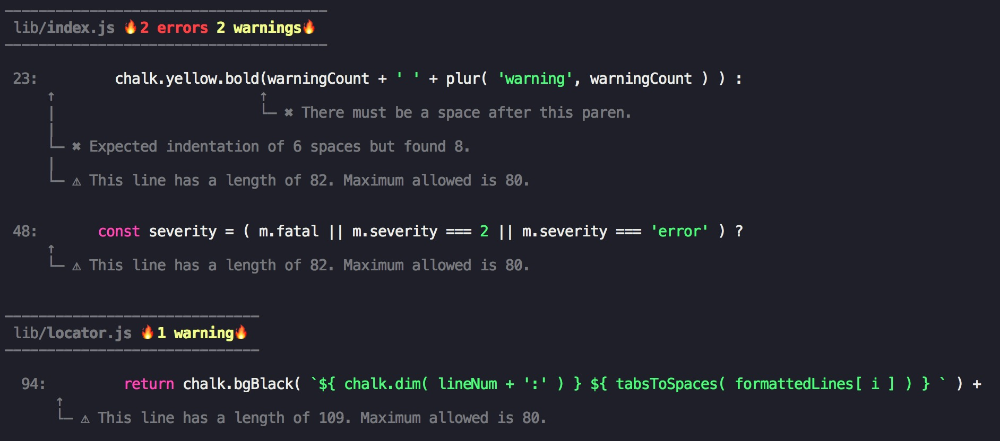

# eslint-formatter-mo

Good-lookin' ESLint formatter



# Installation

```bash
yarn add eslint-formatter-mo --dev
```

or

```bash
npm i eslint-formatter-mo -D
```

# Usage

`eslint [directory] -f mo`

# License

MIT
