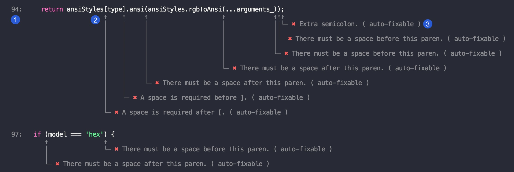
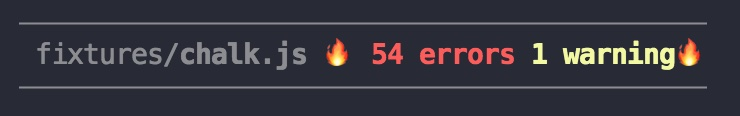
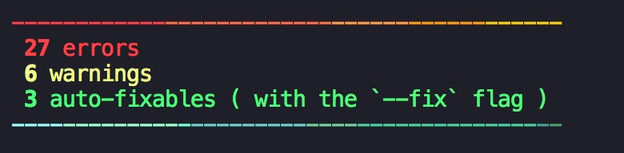

# eslint-formatter-mo


[](https://github.com/semantic-release/semantic-release)
[](https://github.com/fengzilong/eslint-formatter-mo/actions/workflows/release.yml)

Good-lookin' ESLint formatter



🎊 Obviously it's more human-readable 🎉🎉🎉

# Features

- 🎯 Line number
- 🌈 Code highlight
- ⚓️ Position pointer
- 🦄 Error/Warning detail
- 🍻 Auto-fixable is also marked
- 📄 File-level summary
- 📋 Total summary


# Installation

```bash
yarn add eslint-formatter-mo --dev
```

or

```bash
npm i eslint-formatter-mo -D
```

# Usage

Simply append `-f mo` to your eslint command

`eslint [patterns] -f mo`

> -f is short for --format

See [ESLint Formatters](https://eslint.org/docs/user-guide/formatters/#eslint-formatters) for detail

# More screenshots





# License

MIT
