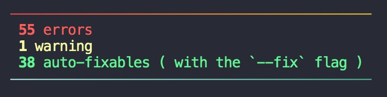

# eslint-formatter-mo


[](https://github.com/semantic-release/semantic-release)
[](https://github.com/fengzilong/eslint-formatter-mo/actions/workflows/release.yml)

Good-lookin' ESLint formatter


🎊 Obviously it's more human-readable 🎉🎉🎉

> [!NOTE]
> This library was moved to ESM from v2.
> 
> If ESM doesn't work well with your Node.js version, check the 1.x version for CJS compatibility.

# Features

- 🎯 Line number
- 🌈 Code highlight
- ⚓️ Position pointer
- 🦄 Error/Warning detail
- 🍻 Auto-fixable is also marked
- 📄 File-level summary
- 📋 Total summary
- 🥳 **Support 50+ VSCode Syntax themes (New feature from v2)**

# Installation

```shell
npm i eslint-formatter-mo -D
```

# Usage

Simply append `-f mo` to your eslint command

`eslint [patterns] -f mo`

> -f is short for --format

See [ESLint Formatters](https://eslint.org/docs/latest/use/formatters/#eslint-formatters) for detail

# Themes

Thanks to [shiki](https://github.com/shikijs/shiki), we now support 50+ VSCode syntax themes in v2.

And you can choose your favorite theme by specifying `MO_THEME` environment variable.

```shell
MO_THEME=<theme_id> eslint [patterns] -f mo
```

theme_id | preview |
---------|----------
 one-dark-pro | 
 dracula | 
 night-owl | 
 vitesse-dark | 
 nord | 
 ... | ...

[Here](https://shiki.style/themes) you can find all the 50+ themes.

# More screenshots




# License

MIT
